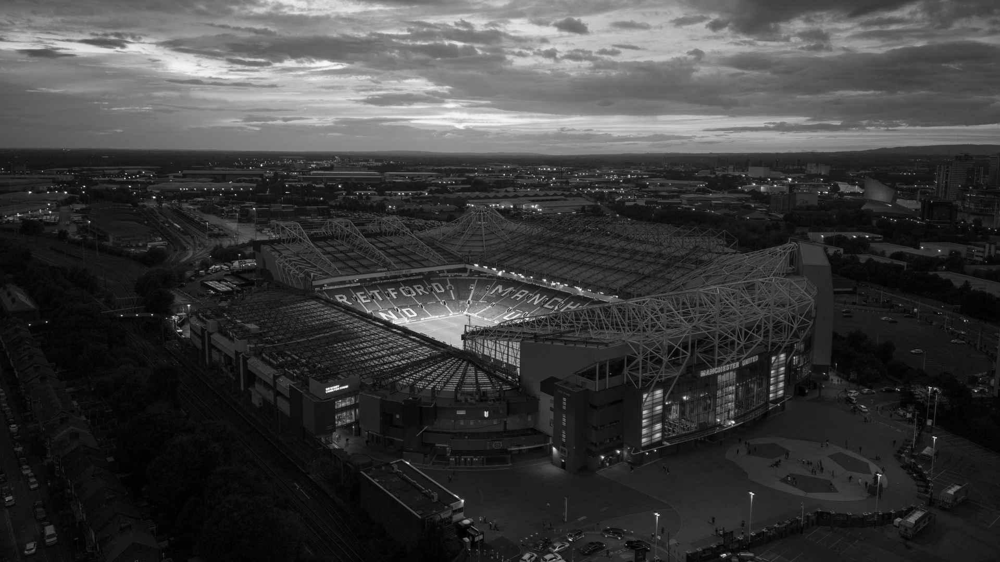
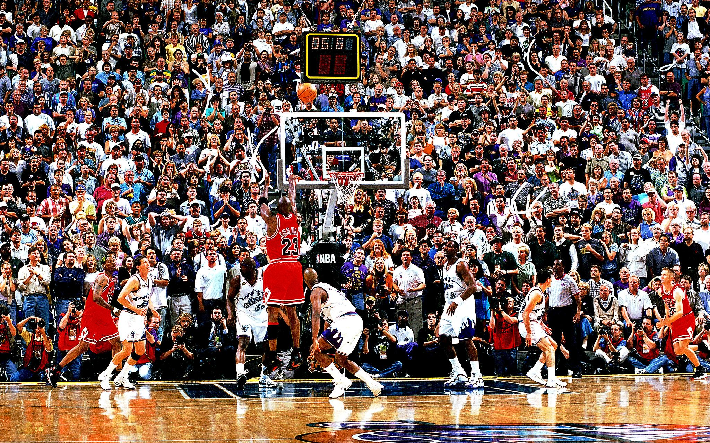
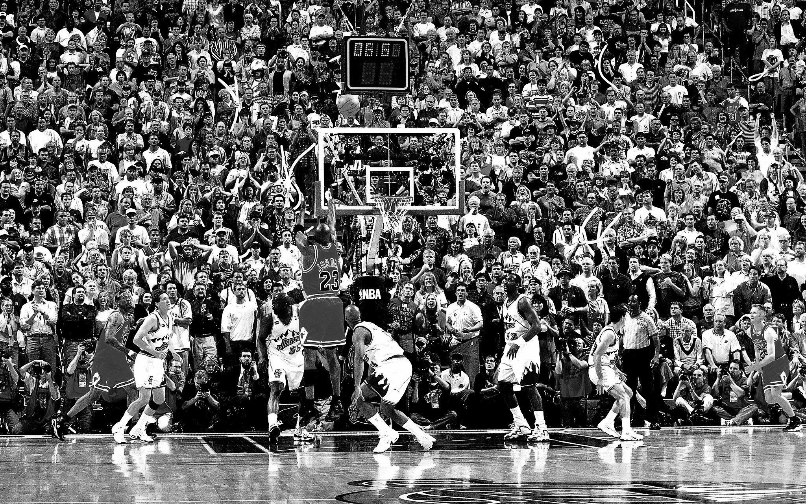
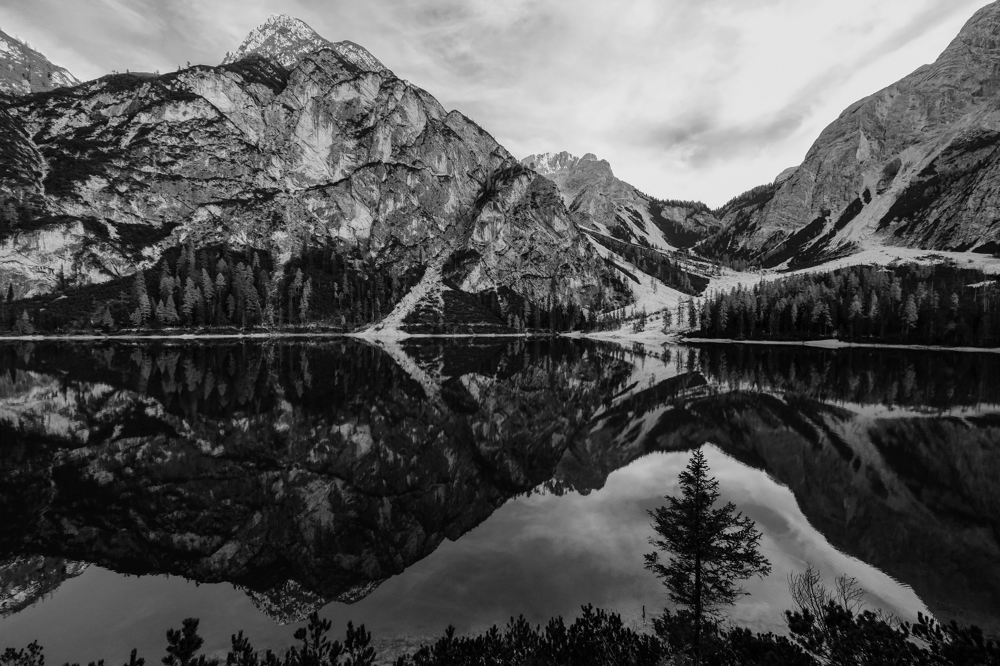

# Assignment 5

Implementation of parallel computation for experimental comparison of the image conversion to grayscale with use of GPU
and CPU.

## 🔬 The problem we are solving

In general, GPUs are faster than CPUs when it comes to performing highly parallelizable tasks, such as matrix
multiplication, image and video processing, and machine learning. This is because GPUs have a larger number of cores
that can perform multiple computations simultaneously, while CPUs have a smaller number of cores that are optimized for
single-threaded performance.

For this code, it's likely that the GPU implementation of the grayscale conversion will
be faster than the CPU implementation, as the conversion of an image to grayscale involves processing each pixel
independently, which can be highly parallelizable.

*The performance may vary depending on the hardware and the image size!*

## 🧑‍💻 Solution

The input `image` is loaded and resized using the `PIL` library. The image is then converted to a `NumPy` array. The
`GrayscaleConverterGPU` and `GrayscaleConverterCPU` objects are initialized.

The `GrayscaleConverterGPU` class is a module for converting RGB images to grayscale using GPU-based computation. It
utilizes the `CUDA` programming model to perform the conversion on the GPU, resulting in faster processing times
compared
to traditional CPU-based methods.

The class takes as input the dimensions of the input image as a tuple of (height, width) and creates a new instance of
the class with this information. It also initializes other attributes such as the number of threads per
block (`(16, 16)` by default) and the number of blocks per grid (calculated by dividing the image height
by `threads_per_block[0 or 1]` and rounding up to the nearest integer) required for the GPU computation.

The `convert_to_grayscale` method is then used to perform the actual conversion. It takes an RGB image as a `NumPy`
array
and returns the resulting grayscale image as another `NumPy` array. The method creates an empty grayscale image with the
same size as the input image, and copies both the input and output images to the GPU memory. It then executes a kernel
function, which calculates the grayscale value of each pixel in the input image and stores it in the output grayscale
image. Finally, the resulting grayscale image is copied back to the host memory and returned.

The `GrayscaleConverterCPU` class is a module for converting RGB images to grayscale using CPU-based computation. It is
a
simpler implementation compared to the `GrayscaleConverterGPU` and does not require any specialized hardware.

The class takes as input the dimensions of the input image as a tuple of (height, width) and creates a new instance of
the class with this information. The class has only one attribute, `image_size`, which stores the dimensions of the
input image.

The `convert_to_grayscale` method is used to perform the actual conversion. It takes an RGB image as a `NumPy` array and
returns the resulting grayscale image as another `NumPy` array. The method extracts the red, green, and blue channels of
the input image, calculates the corresponding grayscale values for each pixel, and creates a new grayscale image from
the calculated grayscale values. The conversion is done using the formula:
`gray = 0.2989 * red + 0.5870 * green + 0.1140 * blue`.
The resulting grayscale image is then returned.

Time of executions for 5 different images with different shapes is compared in the table below.

| Image size | CPU execution time    | GPU execution time  |
|------------|-----------------------|---------------------|
| 590x350    | 0.004138946533203125s | 9.83892822265625s   |
| 1920x1080  | 0.012756109237670898s | 101.60909175872803s |
| 2048x1280  | 0.018149137496948242s | 121.80637192726135s |
| 2899x1933  | 0.05680108070373535s  | 279.8256230354309s  |
| 6000x4000  | 0.2195909023284912s   | 1165.8022260665894s |

*The times of execution for GPU are longer because of my hardware*

    
    
    

    
    
    

    
    
    

    
    
    

    
    
    

*Images are resized to save place in documentation, images in original sizes can be found in the repository*

## ⚙️ Usage

1. Install the `NumPy` library by running `pip install numpy` in your command line interface
2. Install the `numba` library by running `pip install numba` in your command line interface
3. Install the `PIL` library by running `pip install Pillow` in your command line interface
4. Install also other libraries if needed
5. In the `main.py` set the variable `IMAGE_PATH` with the path to the image to grayscale
6. You can also change the name of the output files generated - by default the name of images are `image_gpu.jpg`
   and `image_cpu.jpg`
7. Open a command line interface in the same directory as the `main.py` file
8. Run the script by typing `python main.py` in the command line interface and pressing Enter
9. The script will create four threads and run the `main` function

*If you are running the GPU-based conversion, make sure that you have a compatible NVIDIA GPU and have installed the
required CUDA Toolkit and cuDNN libraries.*

[👆 Back to top](#assignment-5)
